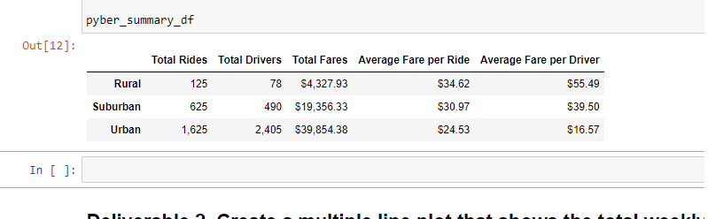
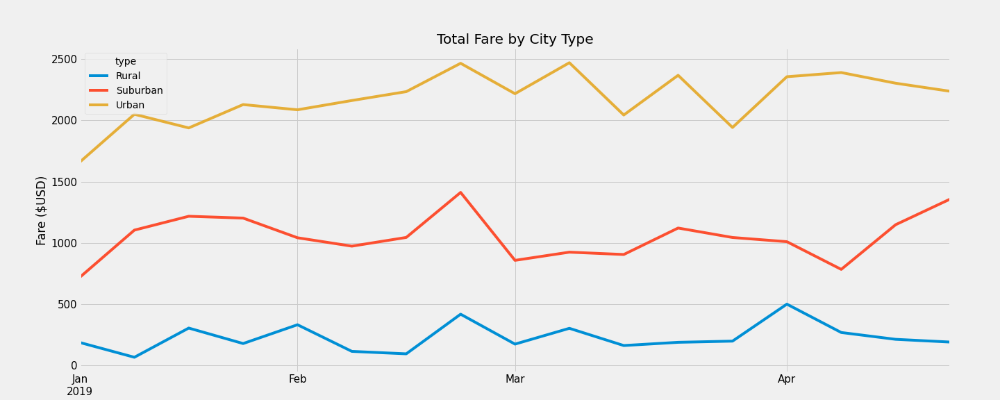

# PyBer_analysis
## Overview of the analysis: 
    The analysis will showcase the correlation between city types, number of drivers, fare costs and riders. 
    This data will assist PyBer in making decisions to improve accesssibility and costs to rideshares in different city types. 

## Results: 
    As the graphs and data shows in the following images, rideshares is utilized more in urban cities compared 
    to rural and suburban cities. The higher usage in urban cities have a lower average fare per ride but 
    demands more drivers. The higher demand in drivers will lower the average fare per driver compared to rural and suburban cities. 

## Summary: 
    Based on the results, I propose the following: 
        1. Descrease fares within rural and suburban cities to increase usage within these city types. The high 
        fares could be deterring riders from using PyBer. 
        2. Reallocate or decrease the amount of drivers within the urban cities. For the four months review of 
        rideshares in urban cities, there were a total of 1,625 rides with a total of 2,405 drivers. The amount of 
        rides is lesser than the total drivers needed. This reallocation/decrease in drivers would provide a financial 
        relief or financial reallocations to the business. 
        3. Lastly, analyses of rides over a year and mapping popular desitinations could be beneficial to reviewing 
        when it is a high peak for rideshares and which locations are popular destinations. This extra analysis would 
        provide more data to support improvements to accessibility and costs for rideshares within all city types. 

        

